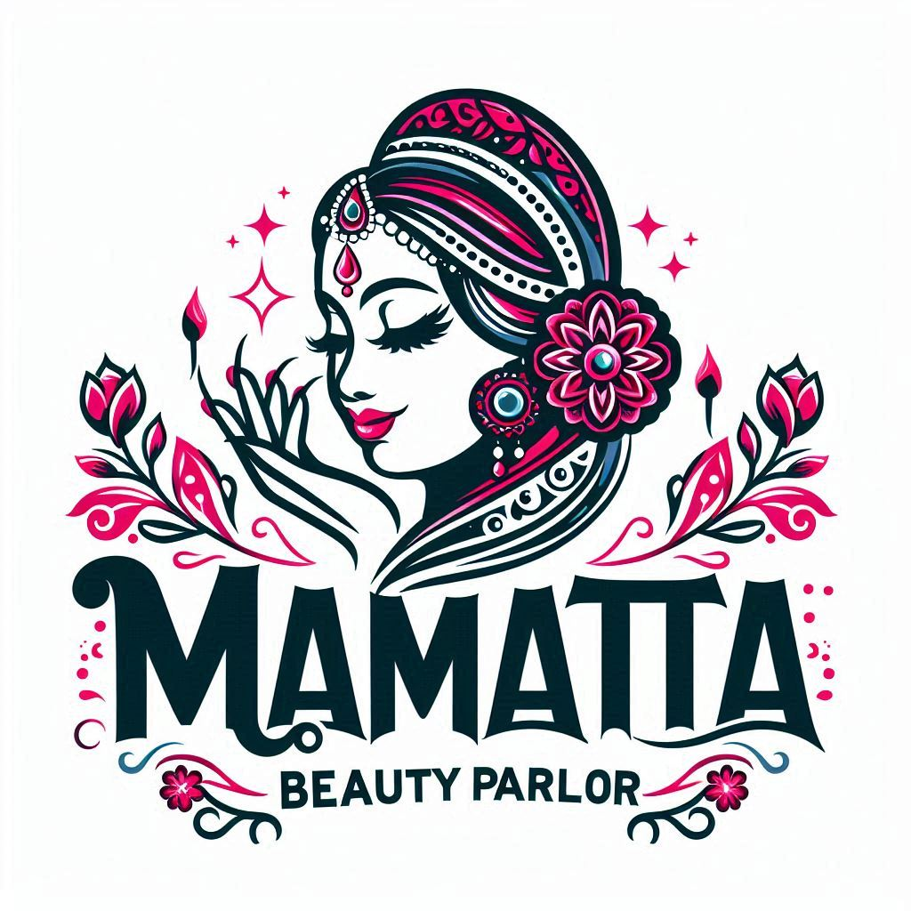

# [Mamata - Beauty Salon & Wellness WordPress Theme](https://github.com/pradipchaudhary/mamata)

  

## Overview

**Mamata - Beauty Salon & Wellness WordPress Theme** is a premium, fully responsive, and customizable WordPress theme crafted for beauty and wellness businesses. Whether you own a beauty salon, spa, wellness center, or cosmetic shop, Mamata offers a sophisticated and modern design that perfectly aligns with your brand’s identity. Its elegant features and intuitive interface make it the ideal solution for creating a powerful online presence that resonates with your audience and drives business growth.

---

### **Theme Specifications**

-   **Minimum WordPress Version:** 4.7
-   **Tested Up To:** WordPress 6.0
-   **Current Version:** 1.0.0
-   **License:** GPLv2 or later
-   **Tags:** two-columns, right-sidebar, flexible-header, custom-colors, custom-header, custom-menu, custom-logo, editor-style, featured-images, footer-widgets, post-formats, theme-options

---

## 🌟 **Key Features**

-   [**Stunning Responsive Design:**](#) Ensures flawless display across all devices, providing an optimal browsing experience whether on mobile, tablet, or desktop.
-   [**Powerful Customization:**](#) Effortlessly personalize your site with an array of layout options, color palettes, and typography settings. No coding skills required!
-   [**Comprehensive Service Pages:**](#) Showcase your services with beautifully designed sections tailored for beauty treatments, spa services, and wellness packages.
-   [**Client Testimonials:**](#) Build credibility and trust with potential clients by displaying glowing reviews in a sleek testimonial slider.
-   [**Elegant Pricing Tables:**](#) Present your pricing in a clear, attractive, and organized manner, helping clients understand your offerings at a glance.
-   [**Captivating Galleries:**](#) Display your portfolio, treatments, or product range with stunning, customizable image galleries that draw visitors in.
-   [**WooCommerce Ready:**](#) Seamlessly integrate with WooCommerce to transform your website into a full-featured online store, ready to sell beauty products, gift cards, and more.
-   [**SEO & Speed Optimized:**](#) Built with best practices to enhance your search engine rankings and ensure fast loading times, keeping users engaged and improving your site's visibility.
-   [**One-Click Demo Import:**](#) Get your site up and running in minutes with our one-click demo import feature, allowing you to easily replicate the demo site.

---

## 🚀 **Installation**

1. **Download the Theme:** Start by clicking the green "Code" button on this page and download the ZIP file.
2. **Upload via WordPress Admin:**
    - Navigate to `Appearance` -> `Themes` in your WordPress dashboard.
    - Click the `Add New` button and then `Upload Theme`.
    - Choose the `mamata.zip` file you downloaded and click `Install Now`.
3. **Activate the Theme:** After installation, click `Activate` to make Mamata live on your website.
4. **Customize Your Theme:** Go to `Appearance` -> `Customize` to begin tailoring the theme to match your brand's unique style.

---

## 🎨 **Customization Guide**

Mamata offers an extensive set of customization options to help you create a website that truly represents your brand. Key areas include:

-   **Header & Footer:** Modify the header and footer to include your logo, social media links, and contact information.
-   **Color Schemes:** Choose from a range of pre-defined color palettes or create your own.
-   **Typography:** Select fonts that resonate with your brand’s voice, from professional to playful.
-   **Page Layouts:** Choose from various page layouts to best present your content, whether it’s a service page, blog, or gallery.

---

## 🤝 **Contributing**

We welcome and encourage contributions to the Mamata theme! Whether it's reporting a bug, suggesting new features, or contributing code, your input is valuable. Feel free to submit a pull request or open an issue on GitHub.

---

## 📜 **License**

**Mamata - Beauty Salon & Wellness WordPress Theme** is open-source software licensed under the GPLv2 (or later). You are free to use, modify, and distribute it, provided you comply with the GPL terms.

**© 2024** [Pradip Chaudhary](https://pradipchaudhary.com.np). All rights reserved.

---

## 🗂️ **Changelog**

### Version 1.0.0

-   **Initial Release:** Launched the first version of Mamata, packed with essential features for beauty and wellness businesses.

---

### **Theme References & Inspiration**

-   **Demo Inspiration:**
    -   [Makeup Artist Demo](https://websitedemos.net/makeup-artist-04/)
    -   [Theme Reference 1](https://htmldemo.net/peerly-v1/tf.html?storefront=envato-elements)
    -   [Theme Reference 2](https://pro-theme.com/html/viasun/index.html?storefront=envato-elements)
    -   [Hair Salon Demo](https://websitedemos.net/hair-salon-04/)
-   **Logo Font:** Corinthia
